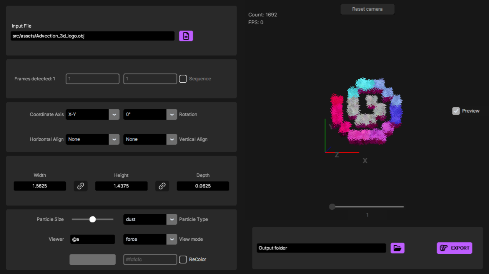

 [](https://github.com/StaxPy/Advection/blob/main/LICENSE)

# Advection - An animation to particles converter
> An app to create Minecraft Java particle animations.



## Description

Creating images and 3D object was made possible in Minecraft using colored particles.
Several projects exist that convert an image or a 3d model into particle commands. This project is similar but with a key feature :

### Animations
Advection let's you convert animations, as well as single images/models.
How ? By using image and model sequences.

### In-game look preview
It also includes an interactive preview screen to check what the result will look like in-game.


## Features


Images and 3D models support (.png, .jpg, .jpeg, .obj)

- Resolution and alpha threshold settings for images.

- Textures, material color and vertex color support for 3D OBJ models

Read and generate animations using file sequences.

- Can export animation sequences (either 2D or 3D) easily

Extensive parameters :

- Align / Rotate / Resize modifiers.

- Particle size, viewer selector, color and more.

Currently support 1.20.5+ particle command format.

# Installation

Download and extract the latest [release](https://github.com/StaxPy/Advection/releases/).

# Guide

## Importing

Loading a file will automatically try to detect a file sequence. If a sequence is found, the "Sequence" mode will be activated. You can disable it if you only want to export one frame.

To detect a sequence, your files names must be identical with a incrementing number in the end.
Example : my_sequence01.png my_sequence02.png etc.

## Sequence settings

You can trim your sequence length by changing the first and last frame in sequence mode.

## Using Images

When using images, you can change its size using height and width (in Minecraft blocks) and density (in particles per block.)

Resolution : increase/decrease the amound of particles generated from the image (1 per pixel), make sure to use 'nearest' resampling when changing resolution of pixelart.

**Keep in mind that high resolutions will lead to a very high number of particles and should be loaded carefully.**

The alpha threshold : Removes any pixel with a transparency lower than that value. (Default is triming below 50%)

## Using models

When using 3D models (OBJs), you can resize your model and use alpha threshold just like images (picking alpha from the texture)

Advection can load **texture color, vertex color, and material color**.
They are chosen according to this priority :

If a material (mtl file) is set and found, it will create a particle **at the center of each face** using color from :
- The texture if found (from the pixel at the center of the face)
- The material color and transparency if no texture is found

If vertex color data is included in the obj file, it will create a particle per vertex using each vertex color.

If none of these are found, it will default to the color setting using each vertex position.

## Particle settings

At the moment, only one of the Minecraft particle types are supported : **"dust"** and **"effect"** (newly entity effect). You can create an issue to let me know if you need other types.

Using dust, you can change the particle size. (Unfortunatly, Minecraft doesnt have a size parameter for the "effect" particles)

You can also set the viewer selector by hand (make sure to write something valid, otherwise the exported commands will be invalid. You can test the selector in-game first.)

Finally, you can enable "ReColor" to force the color of every particle to a custom one. The color picker next to it let's you pick a color easily. Pasting a hexcode is not currently implemented. Create an issue if needed.

## Ouptput

When an input file and an output path are defined, you can export your file(s).

If sequence mode is disabled, the exported .mcfunction will be named like the input file.

If sequence mode is enabled, each frame of the sequence will be named by its number. 1.mcfunction 2.mcfunction etc. This is make it easier to use in-game. More about that in the in-game usage section.


## In-game usage

When you exported, you get mcfunction files. These files should be used inside a [datapack](https://minecraft.wiki/w/Data_pack).

The usage of these functions inside your datapack is for you to decide. Although, playing an animation using function sequences is not the most straight-forward technique so here are some ideas :

Using a scoreboard, you can increment a number each time you want the next frame (every tick or less), and make sure to make it goes back to the beginning when reaching the end.

If you store that score into an entity or storage, you can then use a function macro to call the current frame's. Example:


```mcfunction
# Increment and store the frame
execute store result storage mypack:particle_seq_storage frame int 1 run scoreboard players add current_frame mypack.particle_seq_scoreboard 1

# Call a function with the data as macro argument
function mypack:particles_seq_macro with storage mypack:particle_seq_storage frame
```

```mcfunction
# The macro will redirect to the current frame
$function mypack:my_sequence/$(frame)
```

Note: Baking every call with a if statement for each frame into a single function is an option. Please create an issue if you think that would be better/useful to you.


# Future plans

Future improvements include:
- playable animation in the preview
- every Minecraft particle type support
- particle animations in the preview (requires a complete rewrite of the preview renderer to use OpenGL)

If you need any of these feature or have suggestions for others, please create a feature request/issue !

# Final notes

This is a passion project. I learned most of the python knowledge needed on it. Thus, there is necessarly bugs and optimisation issues I didn't handle quite right. I hope you can enjoy the tool anyways.
# Credits

This project was inspired by [Particle-Converter](https://github.com/kemo14331/Particle-Converter/blob/main/README_EN.md) and [obj to Minecraft Particles](https://www.planetminecraft.com/data-pack/obj-to-minecraft-particles/).

The preview renderer was created with the help of tutorials by [Coder Space](https://youtu.be/M_Hx0g5vFko?si=uPhPYrmbSnbw9-CV).


